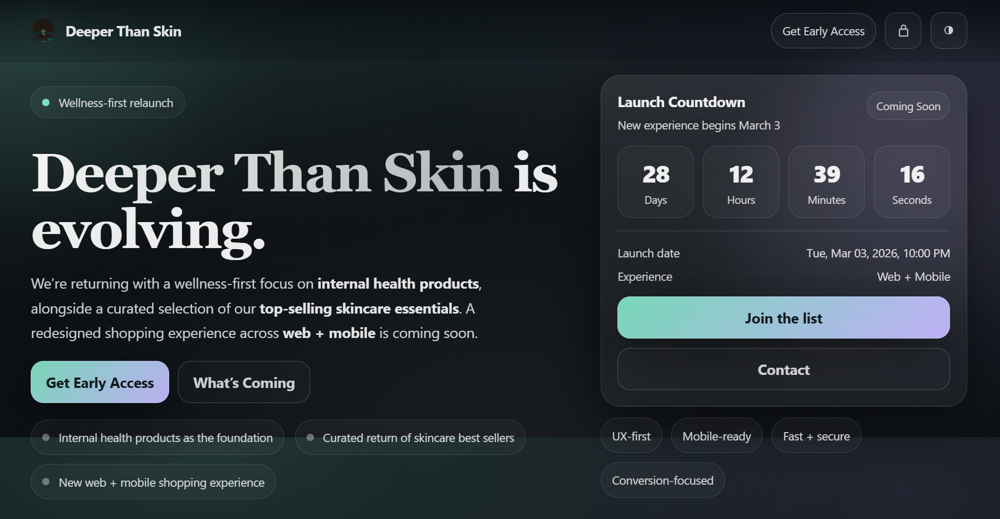

# deeperthanskin-relaunch

🌐 **Live site:**  
https://smashpro-digital.github.io/deeperthanskin-storefront

A premium relaunch landing page for **Deeper Than Skin** as the brand transitions away from Shopify and returns with a **wellness-first focus**: internal health products plus a curated return of top-selling skincare essentials.

This project is deployed via **GitHub Pages** and intentionally showcases modern digital UX polish, including responsive layout, subtle motion, launch countdown, and early-access email capture.

---

## 🚀 Live Preview

🔗 **GitHub Pages:**  
https://smashpro-digital.github.io/deeperthanskin-relaunch

---

## 🖼️ Complete Render Mock-up

Below is a full render preview of the relaunch landing page experience:

> _Note: This preview represents the live GitHub Pages deployment across desktop and mobile._

---

## ✨ What this site includes

- Hero relaunch messaging (wellness-first positioning)
- Launch countdown timer (auto-updates at go-live)
- Early access email capture
- Subtle motion and reveal animations
- Mobile-first responsive layout
- SEO + Open Graph metadata for social sharing
- Clean, accessible UI components
- GitHub Pages–friendly static deployment

---

## 🛠️ Tech & Deployment

- HTML / CSS / Vanilla JS
- GitHub Pages hosting
- No framework dependencies
- Optimized for performance and accessibility

---

## 🧠 Project Context

This relaunch page acts as the **front door** while Deeper Than Skin prepares a new, curated wellness catalog and a redesigned shopping experience across **web and mobile**.

---

## 🤝 Built By

Built with care by  
**[SmashPro Digital](https://dashboard.smashpro.app)**  
Product strategy • UX/UI • Web & Mobile Engineering
